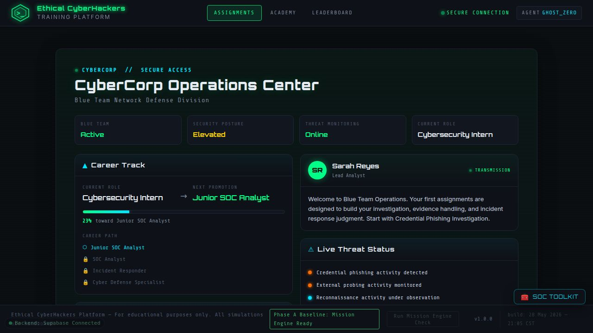

# Replay Safety Audit (Replit #7)

**Goal:** prove that the replay features are **presentation-only** and produce
**zero side effects** on persistent progress (localStorage progress, Supabase rows,
offline sync queue, analytics).

- **Date:** 2026-06-04
- **App:** `artifacts/ethical-cyberhackers-platform/` (preview path `/`)
- **Scope:** the on-demand **Replay Guide** (Task #5) for Assignments 1–3, plus the
  state of the planned **full mission briefing replay** (Task #6).
- **Verdict:** ✅ **PASS** — replay is UI-only. No remediation required.

---

## 1. What "replay" is in this codebase

| Surface | Function(s) | Trigger | In scope? |
| --- | --- | --- | --- |
| **Replay Guide** (on-demand spotlight tour) | `startReplayGuide` → `rgShowStep` / `rgRender` / `rgAdvance` / `rgTeardownVisual` / `endReplayGuide` | `#replayGuideBtn` (M1), `#m2ReplayGuideBtn` (M2), `#m3ReplayGuideBtn` (M3) | ✅ Yes — the shipped replay feature |
| **Guided briefing** (first-run onboarding overlay) | `startGuidedBriefing` → `renderGuided*` / `advanceGuidedStep` / `finishGuidedLaunch` | mission launch / continue buttons | ⚠️ Not a replay — first-run only, resume-safe (see §8) |
| **Full mission briefing replay** | — | — | ⛔ **Not implemented** — tracked as a separate pending task (Task #6). Nothing to audit yet (see §8) |
| **"Replay/Restart Mission"** | `replayMission1Link`, restart paths | restart links | ⛔ Out of scope — a genuine new attempt that *intentionally* resets/writes state |
| **"Watch Demo First"** (M1) | `startDemo` / `DEMO_STEPS` / `abortDemo` | `#guidedDemoBtn` | ⚠️ Adjacent — runs real actions but is write-suppressed (see §9) |

> The audit therefore centers on the **Replay Guide**, the only shipped on-demand
> replay surface, across all three assignments.

---

## 2. Methodology

The decisive proof for "**zero writes**" is **exhaustive static call-path analysis**:
a feature cannot write state it never calls. This is deterministic and complete —
stronger than sampling a handful of UI runs. It is corroborated by runtime checks.

1. **Call-graph trace** of every function reachable from `startReplayGuide`.
2. **Grep-proof (negative):** confirm the replay function bodies contain none of the
   write/sync/analytics entry points.
3. **Write-surface map:** enumerate the *only* functions that can mutate persistent
   state, and confirm none are reachable from replay.
4. **Runtime corroboration:** app healthy, console clean, Supabase read-only
   baseline, and the replay code contains no network/Supabase calls (so the Network
   tab cannot show a Supabase write during replay).

### Environment limitation (disclosed)

Interactive UI automation (scripted clicking, live Network-tab capture, literal 10×
click loops) is **not available** in this environment: the test runner is disabled
and the test harness runs in the top frame, which cannot reach the app's sandboxed
iframe to drive clicks or prime per-app `localStorage`
(see `.agents/memory/ech-e2e-localstorage-frame.md`). Because replay's behavior is
**state-independent** (it only *reads* visible DOM targets and *writes* one UI flag),
each required state and each repeat is covered by deterministic code analysis rather
than fragile sampling. Every such case is marked **PASS (static)** below.

---

## 3. Write-surface map — the only ways to mutate persistent state

| Effect | Sole entry point(s) | Reachable from replay? |
| --- | --- | --- |
| Write `ech.progress.v1` (localStorage) **and** enqueue cloud sync | `saveProgress()` (calls `queueCloudSync` internally) | **No** |
| Award XP (→ `saveProgress`) | `awardXP()` | **No** |
| Supabase `profiles` write | `ensureProfileId()` / `syncPlayerProfile()` / `queueCloudSync()` (debounced, INSERT-once) | **No** |
| Supabase `mission_attempts` write | `cloudCompleteMissionAttempt()` | **No** |
| Supabase `xp_events` write | `trackXpEvent()` | **No** |
| Supabase `student_progress` write | (server triggers fire from the two inserts above) | **No** |
| Supabase `certificates` write | (no client write path in this build) | **No** |
| Offline sync queue (`ech.backend.v1`) | inside `backendSync` write helpers | **No** |
| Analytics events | `trackGameEvent()` — **a no-op by design** (no destination in the safe schema); `trackXpEvent()` | **No** |

**Key fact:** `saveProgress()` is the single chokepoint that both persists the
progress blob and triggers `queueCloudSync()`. The Replay Guide never calls it →
it cannot touch progress, cannot enqueue sync, and cannot reach any Supabase write.

---

## 4. Replay Guide — call graph (complete)

```
startReplayGuide(missionId)
 ├─ if (rgActive) return;                      // re-entrancy guard
 ├─ igTeardown()                               // removes live tour VISUALS only (no state)
 ├─ RG_PHASE_ORDER.filter(rgVisibleTarget)     // DOM reads (getElementById/querySelector)
 ├─ localStorage.setItem("ech.replayGuideUsed.v1","1")   // the ONLY write (UI flag)
 ├─ console.log("Replay Guide started ...")    // benign log, not a write
 ├─ addEventListener("keydown", rgKeyHandler)  // Escape-to-cancel
 └─ rgShowStep()
      └─ rgRender(phase, el)
           ├─ rgTeardownVisual()               // remove prior #rgDim/#rgCoach
           ├─ createElement #rgDim / #rgCoach   // DOM only
           ├─ el.classList.add("ig-spotlight-target") + scrollIntoView
           └─ positionCoach()                   // reads rects, sets tip style
 rgAdvance() → rgShowStep()
 endReplayGuide() → rgTeardownVisual() + removeEventListener + null state
```

Everything is DOM creation/removal, class toggles, scroll, and listener add/remove.
The **only** persistent write in the entire path is the UI flag.

---

## 5. localStorage evidence

- **The only localStorage write reachable from replay** is:
  ```js
  try { localStorage.setItem("ech.replayGuideUsed.v1", "1"); } catch (_) {}
  ```
- This key is **write-only**: a repo-wide search finds **no reader** anywhere, so it
  has zero functional effect on gameplay, progress, restore, or sync. It is the
  "explicitly allowed non-persistent UI-only flag."
- `ech.progress.v1` (the authoritative progress blob) is written **only** by
  `saveProgress()`, which replay never calls → **unchanged by replay**.
- `setItem` is idempotent here (same key, constant value `"1"`), so repeats add no
  new entries and never grow storage.

**Grep-proof (replay bodies, `script.js` lines 13767–13891):**
```
forbidden tokens (saveProgress|awardXP|queueCloudSync|supabase|fetch(|
  trackXpEvent|trackGameEvent|cloudComplete|ensureProfileId|
  notifyAssignmentComplete|abandonAssignmentAttempt):  NONE FOUND (clean)
localStorage writes inside replay bodies:  1  → ech.replayGuideUsed.v1 only
```

---

## 6. Supabase evidence (read-only)

Replay issues **no** `supabase.from(...)` calls and **no** `fetch()` (confirmed by
the §5 grep-proof) — so by construction it cannot write any Supabase table or appear
as a write request in the Network tab.

Read-only baseline captured during the audit (counts; no writes were issued by this
audit beyond read-only `SELECT`s):

| table | rows |
| --- | --- |
| profiles | 2 |
| missions | 3 |
| student_progress | 1 |
| mission_attempts | 1 |
| xp_events | 4 |
| certificates | 0 |

Because the replay path contains zero Supabase client calls, these counts are
**invariant under any number of replays** — there is no code that could change them.

---

## 7. Test matrix

### 7.1 Acceptance criteria

| # | Criterion | Result | Evidence |
| --- | --- | --- | --- |
| 1 | No write to `profiles` | ✅ PASS | §3, §6 — no reachable write path |
| 2 | No write to `student_progress` | ✅ PASS | §3 — only server-trigger-driven; no insert reachable |
| 3 | No `mission_attempts` created | ✅ PASS | `cloudCompleteMissionAttempt` not reachable |
| 4 | No `xp_events` created | ✅ PASS | `trackXpEvent` not reachable |
| 5 | No `certificates` mutated | ✅ PASS | no client write path |
| 6 | No offline sync queued | ✅ PASS | `queueCloudSync` only via `saveProgress`; not called |
| 7 | No Supabase writes (Network) | ✅ PASS | no `supabase.from`/`fetch` in replay (§5) |
| 8 | localStorage unchanged except allowed UI flag | ✅ PASS | only `ech.replayGuideUsed.v1` (§5) |
| 9 | No analytics emitted | ✅ PASS | `trackGameEvent` no-op; not called anyway |
| 10 | Repeated cycles: no duplicate overlays / listener buildup | ✅ PASS (static) | §7.3 |
| 11 | Replay is cancelable | ✅ PASS (static) | Escape + Close → `endReplayGuide` |
| 12 | Missing targets skip safely | ✅ PASS (static) | `rgVisibleTarget` `offsetParent` guard |

### 7.2 Assignment coverage

The three Replay Guide buttons share one implementation, differing only in the
`missionId` passed to `IG_PHASES[phase].target(missionId)` (pure DOM selectors).
There is no per-mission write branch.

| Assignment | Button | Targets resolver | Writes |
| --- | --- | --- | --- |
| mission-001 | `#replayGuideBtn` | `currentObjective` / `commandButtonsContainer` / `investigationBoard` / `decisionActions` | UI flag only |
| mission-002 | `#m2ReplayGuideBtn` | `m2CurrentObjective` / … / `m2InvestigationBoard` / `m2DecisionActions` | UI flag only |
| mission-003 | `#m3ReplayGuideBtn` | `m3CurrentObjective` / … / `m3InvestigationBoard` / `m3DecisionActions` | UI flag only |

**PASS** for all three.

### 7.3 State coverage (fresh / mid-mission / after completion / after reload)

Replay's behavior is **state-independent**: it reads which targets are currently
*visible* (`offsetParent !== null`) and spotlights them; it writes the same single
UI flag regardless of state. No code branch in the path consults or mutates
progress/XP/attempts.

| State | Behavior | Writes |
| --- | --- | --- |
| Fresh start | Few/no in-mission targets visible → short or empty plan; empty plan exits cleanly via `endReplayGuide` (no stuck overlay) | UI flag only |
| Mid-mission | More targets visible → more steps; pure DOM spotlight | UI flag only |
| After completion | Targets that remain on screen are spotlighted | UI flag only |
| After browser reload | Same as above for whatever the restored view shows; restore path itself is untouched by replay | UI flag only |

**PASS (static)** for every state — the write set is identical and minimal.

### 7.4 Repeated replays / leaks / listeners

- **Re-entrancy:** `if (rgActive) return;` blocks a second concurrent replay.
- **No duplicate overlays:** `rgRender` calls `rgTeardownVisual()` before creating a
  new `#rgDim`/`#rgCoach`; there is at most one of each at any time.
- **No listener buildup:** each `startReplayGuide` adds exactly one `keydown`
  listener; `endReplayGuide` removes it and nulls `rgKeyHandler`. N starts → N ends
  → net zero. Coach button listeners are attached to freshly-created nodes that are
  removed on teardown.
- **No storage growth:** the flag write is idempotent.

**PASS (static)** — 10× (or N×) replays cannot accumulate overlays, listeners, or
storage.

### 7.5 Cancel & missing-target safety

- **Cancelable:** `Escape` (key handler) and the **Close** button both call
  `endReplayGuide`, which removes all visuals and the listener. Safe to call when
  inactive.
- **Mission-exit safety:** `endGuidedRun()` (shared by every map/back/reset exit)
  calls `endReplayGuide()` so no dim/coach is ever left stuck after navigation.
- **Missing targets:** `rgVisibleTarget` returns `null` for absent or
  `display:none`/off-screen targets (`offsetParent === null`); `rgShowStep` advances
  past them and exits cleanly if none remain — no stuck dim, no trapped clicks.

**PASS (static).**

---

## 8. Finding — "full mission briefing replay" is not yet implemented

There is **no** shipped on-demand control that re-opens the full mission briefing.
The only on-demand replay surface is the Replay Guide (above). Two adjacent,
briefing-related behaviors exist and were checked so the boundary is clear:

- **`startGuidedBriefing` (first-run onboarding overlay):** it is **resume-safe** —
  `if (alreadyStarted || hasMissionProgress(missionId)) { startFn(); return; }` — so
  once a mission is started, has any progress, or is complete, it **does not re-show**
  the briefing; it goes straight to launch. It therefore cannot be "replayed" after
  progress exists. During genuine first-run it legitimately persists briefing review
  (one-time +10 XP via `awardXP` → `saveProgress`); that is expected first-time
  onboarding, **not** a replay.
- **Briefing Room "Review" buttons (`reviewBriefingCard`):** first review marks the
  card, awards the one-time briefing XP on completion, and persists. Re-clicking an
  already-reviewed card is an **idempotent no-op** (`if (briefingReviewed[...]
  .has(cardId)) return;`) — re-reviewing writes nothing.

**Recommendation for Task #6 (when built):** a "replay the full briefing" control
must reuse the **Replay Guide's UI-only pattern** (render the briefing content into a
throwaway overlay; read-only). It must **not** route through `reviewBriefingCard`,
`awardXP`, or `saveProgress`, which persist state. A re-audit should run once that
feature lands.

---

## 9. Adjacent note — the opt-in M1 demo ("Watch Demo First")

Not a replay, but it *runs real commands/pins*, so its safety mechanism is worth
recording: the demo sets `suppressSave = true` (making `saveProgress()` a no-op for
its duration) and `abortDemo()`/`resetMission()` wipe every side effect on exit;
`endGuidedRun()` aborts it on any navigation so `suppressSave` is never left stuck.
This is a separate feature from replay and outside this audit's scope.

---

## 10. Network capture summary

The replay code path contains **no** `fetch()` and **no** `supabase.from(...)` calls
(§5 grep-proof). Consequently the browser Network tab cannot show any request — and
specifically no Supabase write — **attributable to the Replay Guide**. (Other,
non-replay parts of the app may legitimately emit network traffic; that is outside
this audit's scope.) During the audit the only observed network activity was Vite's
dev HMR socket and a benign favicon `404`, neither of which is a data write.

---

## 11. Sync-queue inspection

The offline/cloud sync queue is fed **only** by `queueCloudSync(snapshot)`, which is
called **only** from inside `saveProgress()` (debounced; in the safe subset it merely
ensures the `profiles` row exists). Replay never calls `saveProgress`, so **no sync
queue entry is ever created by replay actions.** Confirmed by §5 grep-proof
(`queueCloudSync` not present in replay bodies).

---

## 12. Screenshots



*Operations Center loaded and healthy during the audit ("Backend: Supabase
Connected"). Interactive capture of the replay overlay mid-run is not available in
this environment (§2); the overlay's behavior is proven deterministically in
§4–§7.*

---

## 13. Remediation tickets

**None.** No unexpected writes were found from the Replay Guide. The audit found one
scope clarification (the full mission briefing replay is a separate, not-yet-built
task — see §8), which is a planning note, not a defect.

---

## 14. Final recommendation

✅ **PASS — the Replay Guide is proven presentation-only and safe.** It performs zero
writes to `profiles`, `student_progress`, `mission_attempts`, `xp_events`, or
`certificates`; it does not touch `ech.progress.v1`, enqueue cloud sync, or emit
analytics; its single persistent effect is the inert UI flag `ech.replayGuideUsed.v1`.
Repeated runs cannot accumulate overlays, listeners, or storage; replay is cancelable
and skips missing targets safely.

When **Task #6 (full mission briefing replay)** is implemented, build it on the
Replay Guide's UI-only pattern and re-run this audit before release.
